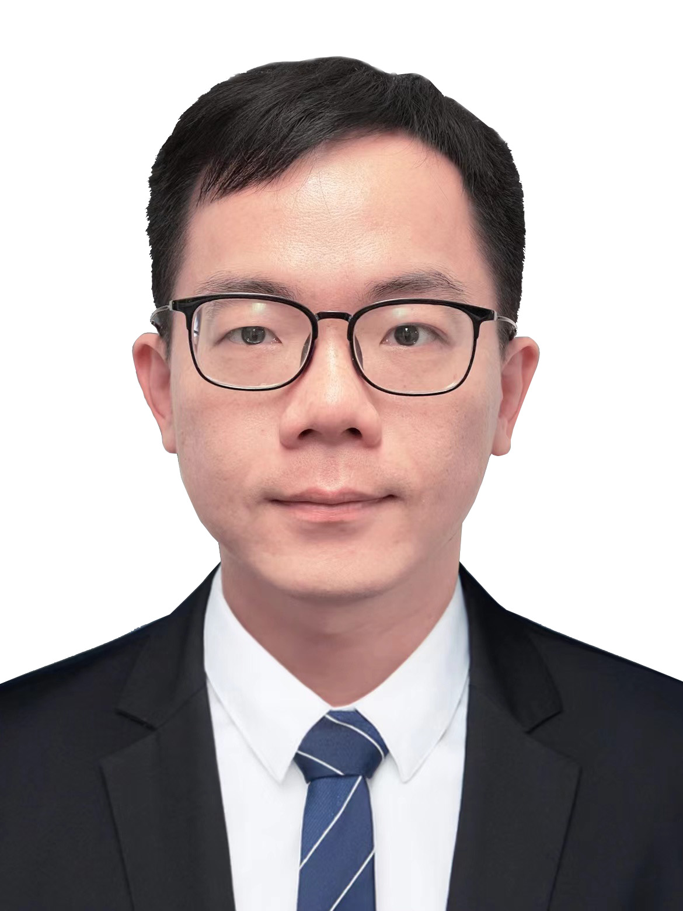

# 中文信息

  

    
  

  

    ## 工作经历
    - **2023-至今** 上海交通大学溥渊未来技术学院 副教授
    - **2020-2022** 英国牛津大学材料系 博士后
    - **2018-2020** 美国德克萨斯大学奥斯汀分校 博士后

    ## 所获荣誉
    - 2018年度美国电化学协会K.M. Abraham奖
    - 2018年度国家优秀自费留学生奖

    ## 科研项目
    - 2024-2026,国家自然科学基金青年基金项目,锂氧气电池气体扩散还原动力学机制及其调控探究,主持,负责人

    ## 学术兼职
    - 《Material Today Energy》,《SusMat》青年编委
  

